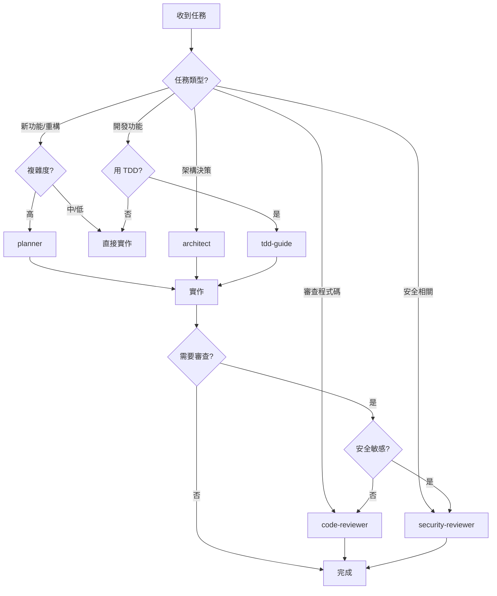

# Specialized Agents

**版本**: 1.0.0  
**來源**: [everything-claude-code](https://github.com/affaan-m/everything-claude-code) (Anthropic Hackathon Winner)  
**適配日期**: 2026-03-12

---

## 📋 總覽

這個目錄包含 5 個專業化 AI agents，各司其職，提升開發品質和效率。

### 為什麼需要專業化 Agents？

**問題**：單一 agent 承擔所有任務，導致：
- 品質不穩定（規劃、實作、審查混在一起）
- 上下文過載（同時處理太多類型的資訊）
- 決策疲勞（每次都要重新建立專業知識）

**解決方案**：專業分工
- 每個 agent 專注特定領域
- 累積該領域的最佳實踐
- 提供一致的高品質輸出

---

## 🤖 Available Agents

| Agent | 用途 | 何時使用 | 推薦模型 |
|-------|------|---------|---------|
| **planner** | 任務規劃分解 | 複雜功能、重構、多檔案變更 | Opus |
| **architect** | 架構設計決策 | 技術選型、系統設計、模式選擇 | Opus |
| **tdd-guide** | TDD 工作流程 | 新功能開發、測試驅動開發 | Sonnet |
| **code-reviewer** | 程式碼審查 | PR 前審查、品質檢查 | Sonnet |
| **security-reviewer** | 安全審查 | 敏感功能、API、認證授權 | Sonnet |

---

## 🚀 使用方式

### 基本語法

```typescript
task(
  subagent_type="[agent-name]",  // planner, architect, tdd-guide, code-reviewer, security-reviewer
  load_skills=[],                // 可選：載入相關 skills
  prompt="[具體任務描述]",
  run_in_background=false        // 通常用同步模式
)
```

### 實際範例

#### 1. Planner - 規劃複雜功能

```typescript
// 場景：需要實作一個新的複雜功能
User: "新增使用者認證系統"

Main Agent: "這是個複雜任務，讓我先調用 planner 進行規劃"

task(
  subagent_type="planner",
  load_skills=[],
  prompt=`規劃使用者認證系統實作

要求：
- JWT token 認證
- 密碼雜湊（bcrypt）
- Session 管理
- 登入/登出/註冊 API
- 密碼重設功能

現有專案結構：
- Backend: Node.js + Express
- Database: PostgreSQL
- Frontend: React

請提供詳細的實作計畫，包含：
1. 檔案結構
2. 實作步驟（按依賴順序）
3. 測試策略
4. 風險評估`,
  run_in_background=false
)

// Planner 會返回：
// - 詳細的分階段計畫
// - 每個步驟的具體檔案路徑
// - 依賴關係圖
// - 測試策略
// - 風險緩解措施
```

#### 2. Architect - 架構設計

```typescript
// 場景：需要做技術決策
User: "我們應該用 REST 還是 GraphQL？"

Main Agent: "這是架構決策，讓我調用 architect"

task(
  subagent_type="architect",
  load_skills=[],
  prompt=`分析 REST vs GraphQL 的選擇

專案背景：
- 電商平台 MVP
- 團隊：3 名全端工程師
- 客戶端：Web (React) + Mobile (React Native)
- 預期流量：1000 DAU
- 開發時間：3 個月

請評估：
1. 技術適用性
2. 開發成本
3. 維護成本
4. 性能考量
5. 團隊學習曲線
6. 推薦方案及理由`,
  run_in_background=false
)

// Architect 會返回：
// - 多維度技術評估
// - 權衡分析（Tradeoffs）
// - 明確推薦及理由
// - 實作建議
```

#### 3. TDD Guide - 測試驅動開發

```typescript
// 場景：開發新功能，想用 TDD
User: "實作購物車結帳功能"

Main Agent: "讓我調用 tdd-guide 指導 TDD 流程"

task(
  subagent_type="tdd-guide",
  load_skills=["test-driven-development"],  // 載入 TDD skill
  prompt=`指導購物車結帳功能的 TDD 開發

功能需求：
- 計算商品小計
- 套用折扣碼
- 計算運費
- 驗證庫存
- 建立訂單

請提供：
1. 測試案例清單（由簡到繁）
2. 每個測試的 Red-Green-Refactor 步驟
3. Edge cases 測試
4. 整合測試策略`,
  run_in_background=false
)

// TDD Guide 會返回：
// - 完整的測試案例列表
// - 逐步的 TDD 指導
// - 測試程式碼範例
// - Refactoring 建議
```

#### 4. Code Reviewer - 程式碼審查

```typescript
// 場景：PR 前自我審查
User: "幫我審查這段登入 API 程式碼"

Main Agent: "讓我調用 code-reviewer"

task(
  subagent_type="code-reviewer",
  load_skills=["requesting-code-review"],
  prompt=`審查登入 API 實作

檔案：src/api/auth/login.ts

重點檢查：
1. 錯誤處理是否完整
2. 輸入驗證是否嚴謹
3. 安全性（密碼處理、SQL injection）
4. 程式碼品質（可讀性、維護性）
5. 測試覆蓋率

專案規範：
- TypeScript strict mode
- ESLint + Prettier
- 測試覆蓋率 >80%`,
  run_in_background=false
)

// Code Reviewer 會返回：
// - 問題清單（按嚴重程度排序）
// - 改進建議
// - 程式碼範例（正確寫法）
// - 測試建議
```

#### 5. Security Reviewer - 安全審查

```typescript
// 場景：涉及敏感操作的功能
User: "實作了密碼重設功能，請檢查安全性"

Main Agent: "安全相關，必須調用 security-reviewer"

task(
  subagent_type="security-reviewer",
  load_skills=[],
  prompt=`審查密碼重設功能的安全性

實作概要：
1. 使用者輸入 email
2. 產生重設 token（UUID）
3. 發送重設連結（email）
4. 驗證 token 並允許重設密碼

檔案：
- src/api/auth/reset-password.ts
- src/services/email.ts
- src/utils/token.ts

請檢查：
1. Token 安全性（長度、隨機性、過期時間）
2. 時序攻擊防護
3. Rate limiting
4. Email 驗證
5. OWASP Top 10 相關風險`,
  run_in_background=false
)

// Security Reviewer 會返回：
// - 安全漏洞列表（Critical/High/Medium/Low）
// - 攻擊場景分析
// - 修復建議（具體程式碼）
// - 安全檢查清單
```

---

## 🔀 Agent 協作模式

### 模式 1：Sequential（順序執行）

```typescript
// 複雜功能的完整流程
User: "新增支付功能（Stripe 整合）"

// Step 1: 規劃
task(subagent_type="planner", prompt="規劃 Stripe 支付整合")
// 輸出：詳細計畫

// Step 2: 架構設計
task(subagent_type="architect", prompt="設計支付系統架構，評估 webhook 處理策略")
// 輸出：架構決策

// Step 3: TDD 開發
task(subagent_type="tdd-guide", prompt="指導支付 API 的 TDD 開發")
// 輸出：測試優先開發指導

// Step 4: 實作
// [Main Agent 執行實作]

// Step 5: 程式碼審查
task(subagent_type="code-reviewer", prompt="審查支付 API 實作")
// 輸出：改進建議

// Step 6: 安全審查
task(subagent_type="security-reviewer", prompt="審查支付流程安全性")
// 輸出：安全加固建議
```

### 模式 2：Conditional（條件觸發）

```typescript
// 根據複雜度決定是否調用 agent
User: "修改按鈕顏色"

Main Agent: [分析] 簡單變更，不需要 agents
Main Agent: [直接實作]

// vs

User: "重構整個認證系統"

Main Agent: [分析] 複雜變更，需要規劃
task(subagent_type="planner", prompt="...")
```

### 模式 3: Parallel（平行執行）

```typescript
// 獨立的審查任務可平行執行
task(subagent_type="code-reviewer", prompt="審查 API 層", run_in_background=true)
task(subagent_type="security-reviewer", prompt="審查安全性", run_in_background=true)

// 收集結果
// [處理兩個 agent 的反饋]
```

---

## 📊 Agent 決策樹



---

## ⚠️ 最佳實踐

### DO ✅

1. **明確的任務描述**
   ```typescript
   // Good
   task(subagent_type="planner", prompt=`
   規劃使用者認證系統
   
   需求：
   - JWT 認證
   - 密碼雜湊
   - Session 管理
   
   專案背景：
   - Node.js + Express
   - PostgreSQL
   `)
   
   // Bad
   task(subagent_type="planner", prompt="做個認證")
   ```

2. **提供足夠上下文**
   - 專案技術棧
   - 現有架構
   - 限制條件
   - 預期目標

3. **循序漸進**
   - 先規劃（planner）
   - 再設計（architect）
   - 後實作（tdd-guide）
   - 最後審查（code-reviewer, security-reviewer）

4. **載入相關 Skills**
   ```typescript
   task(
     subagent_type="tdd-guide",
     load_skills=["test-driven-development", "testing-patterns"],
     prompt="..."
   )
   ```

### DON'T ❌

1. **過度委派**
   ```typescript
   // Bad: 簡單任務不需要 agent
   task(subagent_type="code-reviewer", prompt="幫我改個變數名")
   ```

2. **缺乏上下文**
   ```typescript
   // Bad: 沒有背景資訊
   task(subagent_type="architect", prompt="選個資料庫")
   ```

3. **跳過必要步驟**
   ```typescript
   // Bad: 安全功能沒有 security-reviewer
   [實作支付功能] → [直接上線]
   
   // Good
   [實作] → security-reviewer → [修正] → [上線]
   ```

---

## 🔍 故障排除

### 問題：Agent 回應品質不佳

**可能原因**：
1. Prompt 不夠具體
2. 缺乏專案上下文
3. 未載入相關 skills

**解決方式**：
```typescript
// 改善前
task(subagent_type="planner", prompt="做個功能")

// 改善後
task(
  subagent_type="planner",
  load_skills=["api-design", "security-first"],
  prompt=`
  規劃 RESTful API 端點：使用者個人資料管理
  
  現有架構：
  - Express.js + TypeScript
  - PostgreSQL (Prisma ORM)
  - JWT 認證已實作
  
  需求：
  1. GET /api/users/:id - 取得使用者資料
  2. PATCH /api/users/:id - 更新使用者資料
  3. DELETE /api/users/:id - 刪除帳號
  
  約束：
  - 只能操作自己的資料（驗證 JWT user_id）
  - 敏感欄位不可更新（email 需另外驗證）
  - 刪除為軟刪除
  
  請提供詳細實作計畫。
  `
)
```

### 問題：不確定該用哪個 Agent

**決策流程**：
```
1. 這是規劃任務嗎？ → planner
2. 這是架構決策嗎？ → architect  
3. 要用 TDD 開發嗎？ → tdd-guide
4. 需要審查程式碼嗎？ → code-reviewer
5. 涉及安全敏感嗎？ → security-reviewer
6. 都不是 → 不需要專業 agent，直接實作
```

### 問題：Agent 執行時間過長

**優化策略**：
1. 縮小範圍（只審查變更的檔案）
2. 使用 run_in_background=true（如果不需要立即結果）
3. 分階段執行（不要一次處理所有功能）

---

## 📚 延伸閱讀

- [完整 PRD](../../docs/PRD-claude-code-inspired-upgrades.md) - 功能規劃與決策理由
- [ADR 0009](../../docs/adr/0009-reference-claude-code-architecture.md) - Claude Code 架構參考
- [Skills 系統](./../skills/README.md) - 可與 agents 搭配的 skills
- [everything-claude-code](https://github.com/affaan-m/everything-claude-code) - 原始專案

---

## 🤝 貢獻

發現問題或有改進建議？

1. 檢查是否與原始 everything-claude-code 的定義一致
2. 如果是 OpenCode 適配問題：在本專案提 issue
3. 如果是 agent 定義本身的問題：在上游專案提 issue

---

**License**: MIT (繼承自 everything-claude-code)  
**維護者**: my-vibe-scaffolding template team  
**最後更新**: 2026-03-12
