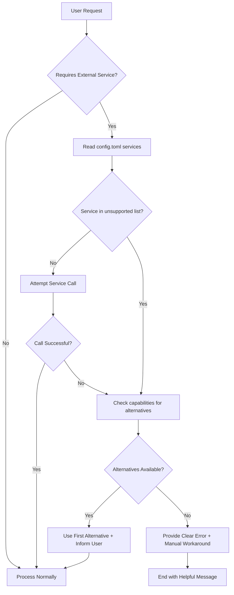

# Service Detection & Capability Management

**Version**: 1.0.0  
**Last Updated**: 2026-03-12  
**Related ADR**: [0009 - Reference Claude Code Architecture](../.template/docs/adr/0009-reference-claude-code-architecture.md)

---

## Purpose

This document defines the **Service Detection Protocol** for OpenCode AI agents to:
1. **Prevent failed service calls** by checking availability before invocation
2. **Provide helpful alternatives** when services are unavailable
3. **Maintain graceful degradation** instead of cryptic error messages

## Quick Reference

**Before calling ANY external service**, AI agents MUST:
1. ✅ Check `config.toml` `[services]` section
2. ✅ Verify service is NOT in `unsupported` list
3. ✅ Use alternatives if service unavailable
4. ✅ Inform user of substitution with clear reasoning

---

## Service Detection Flow



---

## Configuration Structure

### Location
`config.toml` (or `config.toml.example` for defaults)

### Format

```toml
[services]
# List of services that are NOT available in this environment
unsupported = [
  "google-search",   # Google Search API (requires GCP enablement)
  "service-name-2",  # Add more as needed
]

[services.capabilities]
# Map functionality → available alternative tools
web_search = ["websearch_web_search_exa", "webfetch"]
code_search = ["grep_app_searchGitHub"]
documentation = ["context7_query-docs", "context7_resolve-library-id"]

[services.fallback]
mode = "suggest"        # "suggest" | "auto" | "fail"
log_attempts = true     # Log failed attempts for debugging
show_reason = true      # Include reason in error message
```

---

## Detection Protocol (Step-by-Step)

### Step 1: Parse User Intent

Identify if request requires external service:
- Keywords: "search", "look up", "find documentation", "query API"
- Context: unfamiliar library, external data source, web research

### Step 2: Check Service Availability

```python
# Pseudo-code for AI agent logic
def is_service_available(service_name):
    config = read_config("config.toml")
    unsupported = config["services"]["unsupported"]
    
    return service_name not in unsupported
```

### Step 3: Handle Unavailable Service

If service is in `unsupported` list:

**A. Lookup Alternatives**
```python
def get_alternatives(functionality):
    config = read_config("config.toml")
    capabilities = config["services"]["capabilities"]
    
    return capabilities.get(functionality, [])
```

**B. Select Appropriate Alternative**
- Prioritize full-featured tools (e.g., `websearch_web_search_exa` over `webfetch`)
- Consider request context (documentation search → `context7`, code search → `grep_app`)

**C. Inform User**
Use error message template (see below)

### Step 4: Execute with Alternative

```markdown
# Example Output
🔄 Service 'google-search' is not available in this configuration.

Reason: Requires Google Cloud API enablement (SERVICE_DISABLED)

✅ Using alternative: websearch_web_search_exa
Why: Provides clean, LLM-optimized web search results

[Proceeds with search using alternative tool]
```

---

## Error Message Templates

### Template 1: Alternative Available

```markdown
❌ Service '{service_name}' is not available.

**Reason**: {specific_reason}

✅ **Available alternatives**:
  1. {alternative_1} - {description}
  2. {alternative_2} - {description}

**Recommended**: {best_alternative}
**Using**: {chosen_alternative}

[Continues with chosen alternative]
```

### Template 2: No Alternative Available

```markdown
❌ Service '{service_name}' is not available.

**Reason**: {specific_reason}

**No automated alternatives found.**

**Manual workaround**:
{step-by-step instructions for user to accomplish goal}

**To enable this service**:
{instructions to add service capability, if applicable}
```

### Template 3: Multiple Alternatives (User Choice)

```markdown
❌ Service '{service_name}' is not available.

**Available alternatives**:
  1. {alternative_1} - {pros/cons}
  2. {alternative_2} - {pros/cons}

**Which would you prefer?** (Or I can choose based on context)
```

---

## Common Services & Alternatives

| Functionality | Unsupported Service | Alternative Tools | Notes |
|---------------|---------------------|-------------------|-------|
| **Web Search** | `google-search` | `websearch_web_search_exa`, `webfetch` | Exa preferred for LLM-optimized results |
| **Code Search** | N/A | `grep_app_searchGitHub` | Searches public GitHub repos |
| **Documentation** | N/A | `context7_query-docs`, `context7_resolve-library-id` | For official library docs |
| **General Web Fetch** | N/A | `webfetch` | Direct URL content retrieval |

---

## Fallback Modes

### Mode: `suggest` (Default)

**Behavior**: Present alternatives, let AI agent decide based on context

**Use case**: Most situations - balances automation with transparency

**Example**:
```
User: "Search for React best practices"
Agent: [Detects google-search unavailable]
Agent: "Using websearch_web_search_exa as alternative"
Agent: [Executes search with alternative]
```

### Mode: `auto`

**Behavior**: Automatically use first available alternative without notification

**Use case**: High-trust environments, minimal interruption desired

**Risk**: User may not understand why certain tools were used

### Mode: `fail`

**Behavior**: Stop execution with error, require user intervention

**Use case**: Strict environments, debugging, when transparency is critical

**Example**:
```
User: "Search for X"
Agent: "Error: google-search unavailable. Please enable service or use manual search."
Agent: [Stops execution]
```

---

## Extending the System

### Adding a New Unsupported Service

**Step 1**: Update `config.toml`
```toml
[services]
unsupported = [
  "google-search",
  "my-new-service",  # ← Add here
]
```

**Step 2**: Define alternatives (if any)
```toml
[services.capabilities]
my_functionality = ["alternative-tool-1", "alternative-tool-2"]
```

**Step 3**: No code changes needed! Protocol automatically applies.

### Adding a New Capability Category

```toml
[services.capabilities]
# Existing categories
web_search = [...]
code_search = [...]

# New category
image_generation = ["dall-e", "midjourney-api"]  # ← Add new
```

---

## Integration with AGENTS.md

This protocol is referenced in `AGENTS.md` under:
- **AI Agent Communication Protocol** (session start checklist)
- **Service Detection Protocol** (dedicated section)

AI agents MUST read this file at session start to:
1. Load current service configuration
2. Understand fallback behavior
3. Prepare error message templates

---

## Troubleshooting

### Problem: AI agent still attempts unsupported service

**Diagnosis**:
- Check if service name matches exactly (case-sensitive)
- Verify `config.toml` is being read (not stale cache)
- Check if agent is following protocol (review AGENTS.md)

**Solution**:
1. Add all name variations to `unsupported` list (e.g., both `google-search` and `google_search`)
2. Clear agent session cache if applicable
3. Explicitly remind agent in prompt: "Check config.toml before using google-search"

### Problem: No alternative suggested even though one exists

**Diagnosis**:
- Check `[services.capabilities]` mapping
- Verify alternative tool is actually available (not itself unsupported)

**Solution**:
1. Ensure capability key matches functionality (e.g., `web_search` not `websearch`)
2. Test alternative tool manually to confirm availability

### Problem: Error message doesn't show reason

**Diagnosis**:
- `show_reason = false` in config
- Service error doesn't provide detailed reason

**Solution**:
1. Set `show_reason = true` in `config.toml`
2. Update error template to always show generic reason if specific unavailable

---

## Testing the Protocol

### Manual Test Cases

**Test 1**: Unsupported service with alternative
```
User: "Search the web for X"
Expected: Uses websearch_web_search_exa, informs user
Actual: [verify output]
```

**Test 2**: Unsupported service without alternative
```
User: "Use imaginary-service to do Y"
Expected: Error message with manual workaround
Actual: [verify output]
```

**Test 3**: Supported service
```
User: "Use webfetch to get https://example.com"
Expected: Proceeds normally
Actual: [verify output]
```

### Automated Validation

See `.template/scripts/verify-template.sh` for:
- Config format validation
- Service name consistency checks
- Alternative tool availability verification

---

## Change Log

- **2026-03-12**: Initial version (v1.0.0)
  - Service detection protocol defined
  - Error message templates created
  - Fallback modes specified
  - Integration with config.toml established

---

## References

- **ADR 0008**: [OpenCode Configuration Strategy](../.template/docs/adr/0009-reference-claude-code-architecture.md)
- **AGENTS.md**: Service Detection Protocol section
- **config.toml.example**: Service configuration reference
