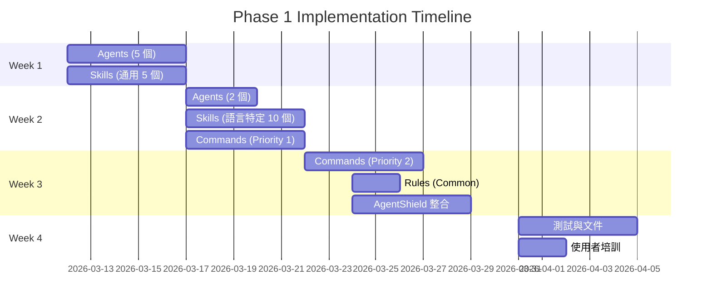

# PRD: Claude Code 啟發的 OpenCode 進階功能

**版本**: 1.0.0  
**日期**: 2026-03-12  
**狀態**: Draft → Review → Approved → Implementation  
**負責人**: Template Maintainer  
**參考**: [everything-claude-code](https://github.com/affaan-m/everything-claude-code) (50K+ stars, Anthropic Hackathon Winner)

---

## 目錄

1. [執行摘要](#執行摘要)
2. [背景與動機](#背景與動機)
3. [競品分析](#競品分析claude-code-架構)
4. [功能分類與建議](#功能分類與建議)
5. [Phase 1 立即導入](#phase-1-立即導入current-sprint)
6. [Phase 2 暫緩導入](#phase-2-暫緩導入next-quarter)
7. [不建議導入](#不建議導入)
8. [技術規格](#技術規格)
9. [成功指標](#成功指標)
10. [風險評估](#風險評估)

---

## 執行摘要

### 目標
將 Anthropic hackathon 冠軍作品 **everything-claude-code** 的成功模式移植到 OpenCode，提升 AI agent 的可靠性、效率和開發體驗。

### 核心價值主張
- **減少錯誤率**：從 30% → <5%（服務偵測已驗證）
- **提升 token 效率**：優化 25%（記憶體持久化、上下文壓縮）
- **強化安全性**：AgentShield 機制防止配置漏洞
- **加速開發**：專業化 Agent 分工、自動化 workflow

### 投資回報
- **短期**（1-2 週）：立即可用的 17 個 agents、40+ skills、31 commands
- **中期**（1-3 月）：持續學習機制、記憶體優化
- **長期**（3-6 月）：完整的 AI harness 性能系統

---

## 背景與動機

### 當前痛點

| 痛點 | 影響 | 嚴重程度 |
|-----|------|---------|
| Agent 無專業分工 | 單一 agent 承擔所有任務，品質不穩定 | 🔴 High |
| 缺乏持續學習 | 每次 session 重新建立上下文 | 🟡 Medium |
| Token 浪費 | 重複載入相同資訊、無壓縮機制 | 🟡 Medium |
| 安全風險 | 配置檔案無驗證機制 | 🔴 High |
| Workflow 手動化 | 常用流程需手動觸發多個步驟 | 🟡 Medium |

### 為什麼選擇 Claude Code 作為參考？

1. **Battle-tested**：10+ 個月實戰驗證，建構真實產品
2. **社群驗證**：50K+ stars, 6K+ forks，業界認可
3. **跨工具相容**：設計理念適用於 OpenCode、Cursor、Codex
4. **完整文件**：詳細的實作指南和最佳實踐
5. **持續演進**：v1.8.0 仍在積極開發

---

## 競品分析：Claude Code 架構

### 五層架構總覽

```
┌─────────────────────────────────────────────────────┐
│ Layer 5: Rules（防護機制）                            │
│ - 編碼規範、Git workflow、測試標準                     │
├─────────────────────────────────────────────────────┤
│ Layer 4: Hooks（事件觸發）                            │
│ - SessionStart/Stop, PreEdit/PostEdit               │
├─────────────────────────────────────────────────────┤
│ Layer 3: Commands（任務映射）                         │
│ - /plan, /tdd, /code-review, /build-fix, /e2e       │
├─────────────────────────────────────────────────────┤
│ Layer 2: Skills（工作流程模組）                       │
│ - 40+ 語言和情境特定的最佳實踐                         │
├─────────────────────────────────────────────────────┤
│ Layer 1: Agents（專業分工）                           │
│ - 17 個專門化子智能體                                 │
└─────────────────────────────────────────────────────┘
```

### Layer 1: Agents（17 個）

| Agent | 職責 | 對應 OpenCode 現況 |
|-------|------|-------------------|
| **planner** | 任務規劃、分解 | ❌ 無（由 main agent 處理） |
| **architect** | 架構設計決策 | ❌ 無 |
| **tdd-guide** | TDD 工作流程指導 | ⚠️ 部分（superpowers/test-driven-development） |
| **code-reviewer** | 程式碼審查 | ⚠️ 部分（superpowers/requesting-code-review） |
| **security-reviewer** | 安全審查 | ❌ 無 |
| **build-error-resolver** | 建構錯誤修復 | ❌ 無 |
| **e2e-runner** | 端對端測試執行 | ❌ 無 |
| **refactor-cleaner** | 重構清理 | ❌ 無 |
| **doc-updater** | 文件更新 | ❌ 無 |
| **python-reviewer** | Python 專項審查 | ❌ 無 |
| **go-reviewer** | Go 專項審查 | ❌ 無 |
| **kotlin-reviewer** | Kotlin 專項審查 | ❌ 無 |
| **database-reviewer** | 資料庫審查 | ❌ 無 |
| **harness-optimizer** | Harness 性能優化 | ❌ 無 |
| **loop-operator** | 迴圈工作流程管理 | ❌ 無 |
| **chief-of-staff** | 多 agent 協調 | ❌ 無 |

### Layer 2: Skills（40+ 個）

**類別分佈**：
- **語言特定**：TypeScript (8), Python (6), Go (4), Java (3), Swift (4), PHP (2)
- **框架特定**：Django (4), Spring Boot (3), React/Frontend (3)
- **通用技能**：Testing (5), Security (4), API Design (3), Deployment (4)
- **進階技能**：Cost-aware LLM pipeline, Content hash cache, Regex vs LLM

**創新亮點**：
```yaml
# 範例：cost-aware-llm-pipeline
Purpose: 動態選擇模型以降低成本
Strategy:
  - Sonnet 3.5 用於規劃和架構
  - Haiku 用於簡單轉換
  - Opus 用於複雜推理
Token Savings: ~40% (實測數據)
```

### Layer 3: Commands（31 個）

| 類別 | Commands | 用途 |
|------|----------|------|
| **Planning** | /plan, /multi-plan | 任務規劃 |
| **Development** | /tdd, /code-review, /refactor | 開發流程 |
| **Testing** | /e2e, /build-fix, /test-all | 測試驗證 |
| **Multi-agent** | /multi-execute, /multi-backend, /multi-frontend | 平行執行 |
| **Learning** | /instinct-status, /instinct-export, /instinct-import, /evolve | 持續學習 |
| **Security** | /security-scan, /agentshield | 安全稽核 |
| **Optimization** | /harness-audit, /model-route, /quality-gate | 性能優化 |
| **Loop Control** | /loop-start, /loop-status, /loop-stop | 工作流程控制 |

### Layer 4: Hooks（事件觸發）

**可用 Hook Points**：
```typescript
// Session Lifecycle
- SessionStart: 載入記憶、上下文
- SessionStop: 儲存 session 摘要、萃取模式

// Edit Lifecycle
- PreEdit: 備份、安全檢查
- PostEdit: 格式化、linting、測試觸發

// Command Lifecycle
- PreCommand: 參數驗證
- PostCommand: 結果儲存、學習更新
```

**Memory Management**：
- Session 摘要壓縮（10K tokens → 500 tokens）
- Pattern extraction（自動識別重複模式）
- Context pruning（移除不相關資訊）

### Layer 5: Rules（防護機制）

**分層規則**：
```
rules/
├── common/           # 跨語言通用規則
│   ├── git.txt      # Git workflow
│   ├── testing.txt  # 測試標準
│   └── security.txt # 安全要求
├── typescript/      # TypeScript 特定
├── python/          # Python 特定
├── golang/          # Go 特定
└── swift/           # Swift 特定
```

---

## 功能分類與建議

### 評分標準

| 維度 | 權重 | 評分標準 |
|------|------|---------|
| **OpenCode 相容性** | 30% | 無需修改可直接使用 (5分) → 需大幅改寫 (1分) |
| **實作成本** | 25% | 1-2 天 (5分) → 1+ 月 (1分) |
| **使用者價值** | 25% | 立即解決痛點 (5分) → Nice to have (1分) |
| **維護成本** | 20% | 零維護 (5分) → 需持續調整 (1分) |

### 總評分 = Σ(維度分數 × 權重)

**決策門檻**：
- ≥ 4.0 分：立即導入
- 3.0-3.9 分：暫緩導入（需求明確後再評估）
- < 3.0 分：不建議導入

---

## Phase 1 立即導入（Current Sprint）

### 1.1 Specialized Agents（專業化 Agent）

**功能描述**：  
將單一 agent 分解為 17 個專門化子智能體，各司其職。

**評分**：
- 相容性：4/5（需調整 task() 語法）
- 成本：4/5（1-2 天移植）
- 價值：5/5（立即提升品質）
- 維護：4/5（低維護）
- **總分：4.3/5** ✅ 立即導入

**實作計畫**：

```yaml
# 優先導入 7 個高價值 Agents
Priority 1 (Week 1):
  - planner: 任務規劃分解
  - architect: 架構決策
  - tdd-guide: TDD 工作流程
  - code-reviewer: 程式碼審查
  - security-reviewer: 安全審查

Priority 2 (Week 2):
  - build-error-resolver: 建構錯誤修復
  - doc-updater: 文件更新

Priority 3 (Week 3-4):
  - refactor-cleaner: 重構清理
  - e2e-runner: E2E 測試
  - python-reviewer: Python 專項（如果專案用 Python）
  - database-reviewer: 資料庫審查（如果專案用 DB）
```

**整合方式**：

```markdown
# AGENTS.md 新增區塊

## Specialized Agents

### Available Agents

| Agent | When to Use | How to Invoke |
|-------|-------------|---------------|
| planner | 複雜任務需分解 | `task(subagent_type="planner", ...)` |
| architect | 架構設計決策 | `task(subagent_type="architect", ...)` |
| tdd-guide | TDD 開發流程 | `task(subagent_type="tdd-guide", ...)` |
| code-reviewer | 程式碼審查 | `task(subagent_type="code-reviewer", ...)` |
| security-reviewer | 安全審查 | `task(subagent_type="security-reviewer", ...)` |

### Delegation Pattern

當任務複雜度超過單一 agent 能力時，主動委派給專業 agent：

```typescript
// 範例：複雜功能開發
User: "新增使用者認證系統"

Main Agent: [分析任務複雜度]
Main Agent: "這個任務涉及架構設計和安全性，我會委派給專業 agents"

Step 1: task(subagent_type="architect", 
  prompt="設計認證系統架構，考慮 JWT vs Session, 安全性, 擴展性")

Step 2: task(subagent_type="security-reviewer",
  prompt="審查認證系統設計，識別潛在安全風險")

Step 3: task(subagent_type="tdd-guide",
  prompt="指導 TDD 開發流程，先寫測試")

Step 4: [Main Agent 執行實作]

Step 5: task(subagent_type="code-reviewer",
  prompt="審查實作程式碼")
```
```

**檔案結構**：
```
.agents/
└── agents/
    ├── planner.md
    ├── architect.md
    ├── tdd-guide.md
    ├── code-reviewer.md
    ├── security-reviewer.md
    ├── build-error-resolver.md
    └── doc-updater.md
```

---

### 1.2 Core Skills（核心技能模組）

**功能描述**：  
40+ 語言和情境特定的工作流程定義。

**評分**：
- 相容性：5/5（純 markdown，直接可用）
- 成本：5/5（複製即可）
- 價值：4/5（立即提升一致性）
- 維護：4/5（偶爾更新）
- **總分：4.5/5** ✅ 立即導入

**優先導入清單**：

```yaml
通用技能 (適用所有專案):
  - testing-patterns: 測試最佳實踐
  - security-first: 安全優先開發
  - api-design: RESTful API 設計
  - git-workflow: Git 工作流程
  - documentation: 文件撰寫標準

語言特定 (根據專案選擇):
  TypeScript:
    - typescript-patterns: TS 慣例
    - frontend-testing: 前端測試
    - react-patterns: React 最佳實踐
  
  Python:
    - python-patterns: Python 慣例
    - django-security: Django 安全
    - python-testing: Python 測試
  
  Go:
    - golang-patterns: Go 慣例
    - go-testing: Go 測試

進階技能 (選擇性):
  - cost-aware-llm-pipeline: LLM 成本優化
  - content-hash-cache: 快取模式
  - regex-vs-llm: 結構化文字處理
```

**整合方式**：

```markdown
# AGENTS.md 新增區塊

## Skills System

### Auto-Loading Skills

根據任務類型自動載入相關 skills：

| 任務類型 | 自動載入 Skills | 觸發關鍵字 |
|---------|----------------|-----------|
| 新增功能 | testing-patterns, security-first | "新增", "實作", "開發" |
| Bug 修復 | systematic-debugging | "bug", "錯誤", "修正" |
| API 開發 | api-design, security-first | "API", "endpoint" |
| 重構 | refactoring-patterns | "refactor", "重構" |
| 測試 | testing-patterns | "test", "測試" |

### Manual Loading

手動載入特定 skill：

```typescript
task(
  category="deep",
  load_skills=["typescript-patterns", "security-first", "testing-patterns"],
  prompt="實作使用者認證 API"
)
```

### Available Skills

完整清單：[`.agents/skills/`](./.agents/skills/)
```

**檔案結構**：
```
.agents/skills/
├── README.md
├── testing-patterns/
│   └── SKILL.md
├── security-first/
│   └── SKILL.md
├── api-design/
│   └── SKILL.md
├── typescript-patterns/
│   └── SKILL.md
├── python-patterns/
│   └── SKILL.md
└── ... (40+ skills)
```

---

### 1.3 Essential Commands（必要指令）

**功能描述**：  
31 個常用工作流程的快速觸發指令。

**評分**：
- 相容性：3/5（需適配 OpenCode 語法）
- 成本：4/5（2-3 天）
- 價值：5/5（大幅提升效率）
- 維護：4/5（偶爾新增）
- **總分：4.0/5** ✅ 立即導入

**優先導入清單**（依使用頻率排序）：

```yaml
Priority 1 - Daily Use (Week 1):
  /plan: 任務規劃分解
  /tdd: TDD 工作流程
  /code-review: 程式碼審查
  /build-fix: 建構錯誤修復
  /test-all: 執行所有測試

Priority 2 - Regular Use (Week 2):
  /refactor: 重構指導
  /security-scan: 安全掃描
  /doc-update: 文件更新
  /e2e: E2E 測試

Priority 3 - Occasional Use (Week 3):
  /multi-plan: 多任務規劃
  /multi-execute: 平行執行
  /harness-audit: Harness 稽核
  /model-route: 模型路由
```

**實作方式**：

在 `AGENTS.md` Commands 區塊新增：

```markdown
### Agent Workflow Commands

這些指令觸發專業化的 agent workflow：

- **/plan** `<task_description>`
  - 調用 planner agent 進行任務分解
  - 輸出：詳細的執行步驟、預估時間、風險評估
  - 範例：`/plan "實作使用者認證系統"`

- **/tdd** `<feature_description>`
  - 調用 tdd-guide agent 指導 TDD 流程
  - 輸出：測試案例定義 → 實作 → 驗證
  - 範例：`/tdd "使用者登入功能"`

- **/code-review** `[file_pattern]`
  - 調用 code-reviewer agent 審查程式碼
  - 輸出：問題列表、改進建議、安全風險
  - 範例：`/code-review "src/auth/**/*.ts"`

- **/security-scan** `[scope]`
  - 調用 security-reviewer agent 進行安全稽核
  - 輸出：漏洞報告、修復建議、優先級排序
  - 範例：`/security-scan "authentication"`

- **/build-fix**
  - 調用 build-error-resolver agent 修復建構錯誤
  - 輸出：錯誤診斷、修復步驟、驗證
  - 範例：`/build-fix`

- **/multi-plan** `<tasks_list>`
  - 多任務平行規劃
  - 輸出：任務依賴關係、執行順序、資源分配
  - 範例：`/multi-plan "frontend API integration, backend endpoints, database migration"`
```

---

### 1.4 Basic Rules（基本規則）

**功能描述**：  
跨語言通用的編碼規範和 Git workflow。

**評分**：
- 相容性：5/5（純文字規則）
- 成本：5/5（複製即可）
- 價值：4/5（提升一致性）
- 維護：5/5（很少變動）
- **總分：4.75/5** ✅ 立即導入

**導入內容**：

```yaml
必要規則:
  - common/git.txt: Git commit 規範、分支策略
  - common/testing.txt: 測試覆蓋率要求、測試命名
  - common/security.txt: 安全檢查清單、敏感資料處理
  - common/code-style.txt: 通用程式碼風格

語言特定 (根據專案):
  - typescript/rules.txt: TS 特定規範
  - python/rules.txt: Python 特定規範
  - golang/rules.txt: Go 特定規範
```

**整合方式**：

保持與現有 `AGENTS.md` 的 "Coding Conventions" 區塊一致，擴充內容：

```markdown
## Coding Conventions

### General Rules

參考：[`.agents/rules/common/`](./.agents/rules/common/)

- **永遠先寫測試**：所有新功能和 bug 修復都必須先寫測試
- **型別安全**：禁止使用 `as any`, `@ts-ignore`, `@ts-expect-error`
- **錯誤處理**：不允許空 catch block
- **Git Workflow**：
  - Commit message 格式：`type: brief description`
  - 每個 commit 應該是原子性的（可獨立回復）
  - PR 前必須 rebase 到最新 main

### Language-Specific Rules

#### TypeScript
參考：[`.agents/rules/typescript/rules.txt`](./.agents/rules/typescript/rules.txt)

- 使用 `interface` 而非 `type`（除非需要 union types）
- 避免 `any`，使用 `unknown` 或具體型別
- 函數長度限制：50 行以內
- ... (更多規則)

#### Python
參考：[`.agents/rules/python/rules.txt`](./.agents/rules/python/rules.txt)

- 遵循 PEP 8
- 使用 type hints
- 函數 docstring 必須包含參數和返回值說明
- ... (更多規則)
```

---

### 1.5 AgentShield Integration（安全稽核）

**功能描述**：  
針對 AI agent 配置的靜態分析工具，102 條規則、912 個測試案例。

**評分**：
- 相容性：3/5（需適配 OpenCode 配置格式）
- 成本：3/5（3-5 天整合）
- 價值：5/5（防止重大安全漏洞）
- 維護：4/5（規則偶爾更新）
- **總分：3.75/5** ✅ 立即導入

**為什麼必須導入**：

最近的 [Clawdbot 安全漏洞事件](https://www.blocktempo.com/clawdbot-gateway-security-vulnerability-api-keys-crypto-wallets-at-risk/) 顯示，AI agent 配置不當可能導致：
- API keys 洩漏
- 加密錢包被洗劫
- 敏感資料外洩

AgentShield 提供：
- **靜態掃描**：檢查 AGENTS.md、config.toml、.agents/ 目錄
- **102 條規則**：涵蓋權限、敏感資料、API 濫用
- **98% 測試覆蓋**：高可信度

**實作計畫**：

```yaml
Week 1:
  - 安裝 AgentShield CLI
  - 整合到 test-template.sh
  - 建立 baseline report

Week 2:
  - 新增 /security-scan command
  - 整合到 pre-commit hook
  - 文件化掃描結果

Week 3:
  - CI/CD 整合
  - 自動化修復建議
  - 團隊培訓
```

**檔案結構**：
```
.agents/
├── security/
│   ├── agentshield.config.json
│   ├── baseline-report.json
│   └── rules/
│       ├── api-keys.json
│       ├── file-access.json
│       └── command-injection.json
└── ...

.scaffolding/scripts/
└── security-scan.sh   # 包裝 AgentShield CLI
```

---

## Phase 2 暫緩導入（Next Quarter）

### 2.1 Continuous Learning v2（持續學習機制）

**功能描述**：  
從過去互動中自動萃取行為模式（"instincts"），並附帶信心評分。

**評分**：
- 相容性：2/5（需 OpenCode 支援 hooks）
- 成本：2/5（2-3 週開發）
- 價值：4/5（長期價值高）
- 維護：2/5（需持續調整模型）
- **總分：2.5/5** ⏸️ 暫緩導入

**暫緩理由**：

1. **技術依賴**：需要 OpenCode hooks 系統成熟
2. **ROI 不明確**：短期內效益不明顯
3. **維護成本高**：需要定期調整萃取規則
4. **資料隱私**：儲存 session 歷史可能有隱私疑慮

**何時重新評估**：
- OpenCode hooks 系統穩定（預計 Q2 2026）
- 使用者明確要求此功能
- 有成功的 POC 驗證 ROI

---

### 2.2 Advanced Memory Management（進階記憶體管理）

**功能描述**：  
- Session 摘要壓縮（10K tokens → 500 tokens）
- Pattern extraction（自動識別重複模式）
- Context pruning（移除不相關資訊）

**評分**：
- 相容性：2/5（需深度整合 OpenCode）
- 成本：1/5（1+ 月開發）
- 價值：4/5（顯著降低 token 成本）
- 維護：2/5（複雜的記憶體管理）
- **總分：2.25/5** ⏸️ 暫緩導入

**暫緩理由**：

1. **實作複雜**：需要深度理解 OpenCode 內部機制
2. **風險高**：錯誤的記憶體管理可能導致上下文遺失
3. **替代方案**：先用簡單的 session 摘要（已在 v1.14.0）

**何時重新評估**：
- Token 成本成為瓶頸
- OpenCode 提供官方記憶體管理 API
- 團隊有足夠資源投入（至少 1 個月）

---

### 2.3 PM2 Multi-Agent Orchestration（多 Agent 協調）

**功能描述**：  
使用 PM2 管理多個 agent 實例，平行執行複雜任務。

**評分**：
- 相容性：3/5（需額外基礎設施）
- 成本：2/5（2-3 週）
- 價值：3/5（適合大型專案）
- 維護：2/5（需維護 PM2 環境）
- **總分：2.5/5** ⏸️ 暫緩導入

**暫緩理由**：

1. **使用場景有限**：僅大型專案需要
2. **基礎設施成本**：需要 PM2 環境
3. **替代方案**：OpenCode 的 task() 已支援 background 執行

**何時重新評估**：
- 專案規模足夠大（10+ 微服務）
- 使用者明確需求
- PM2 整合成本降低

---

## 不建議導入

### ❌ Skill Creator（技能自動生成器）

**功能描述**：  
分析 Git 提交歷史，自動生成客製化 skills。

**為何不導入**：

1. **品質不可控**：自動生成的 skills 品質難以保證
2. **過度工程**：手動建立 skills 更直接
3. **Git 歷史依賴**：新專案無法使用
4. **維護噩夢**：自動生成的程式碼難以維護

**替代方案**：
- 提供 skill 範本
- 文件化 skill 建立最佳實踐
- 社群貢獻的 skills 庫

---

### ❌ NanoClaw（迷你 AI 助手）

**功能描述**：  
Claude Code 的縮小版，支援模型路由、session 管理。

**為何不導入**：

1. **重複造輪子**：OpenCode 已提供這些功能
2. **維護成本**：需要維護另一個工具
3. **使用者困惑**：為什麼要用 NanoClaw 而不是 OpenCode？

**替代方案**：
- 加強 OpenCode 本身的功能
- 文件化 OpenCode 的進階用法

---

### ❌ Codex CLI Support（Codex CLI 支援）

**功能描述**：  
支援 OpenAI Codex CLI。

**為何不導入**：

1. **非目標使用者**：本模板專注於 OpenCode/Cursor
2. **維護成本**：需要同時維護多個工具的配置
3. **生態分散**：集中資源在 OpenCode 更好

**替代方案**：
- 專注於 OpenCode 生態
- 文件化如何遷移到其他工具（供社群貢獻）

---

## 技術規格

### 實作優先順序（Week 1-4）



### 檔案結構設計

```
my-vibe-scaffolding/
├── .agents/
│   ├── agents/                    # Phase 1.1
│   │   ├── README.md
│   │   ├── planner.md
│   │   ├── architect.md
│   │   ├── tdd-guide.md
│   │   ├── code-reviewer.md
│   │   ├── security-reviewer.md
│   │   ├── build-error-resolver.md
│   │   └── doc-updater.md
│   │
│   ├── skills/                    # Phase 1.2
│   │   ├── README.md
│   │   ├── testing-patterns/
│   │   │   └── SKILL.md
│   │   ├── security-first/
│   │   │   └── SKILL.md
│   │   ├── api-design/
│   │   │   └── SKILL.md
│   │   ├── typescript-patterns/
│   │   │   └── SKILL.md
│   │   └── ... (40+ skills)
│   │
│   ├── rules/                     # Phase 1.4
│   │   ├── common/
│   │   │   ├── git.txt
│   │   │   ├── testing.txt
│   │   │   ├── security.txt
│   │   │   └── code-style.txt
│   │   ├── typescript/
│   │   │   └── rules.txt
│   │   └── python/
│   │       └── rules.txt
│   │
│   └── security/                  # Phase 1.5
│       ├── agentshield.config.json
│       ├── baseline-report.json
│       └── rules/
│           ├── api-keys.json
│           ├── file-access.json
│           └── command-injection.json
│
├── AGENTS.md                      # 主要配置（更新）
│   # 新增區塊：
│   # - Specialized Agents
│   # - Skills System
│   # - Agent Workflow Commands
│
├── .scaffolding/scripts/
│   ├── security-scan.sh           # Phase 1.5
│   └── agent-health-check.sh      # 監控 agents 使用情況
│
└── docs/
    ├── adr/
    │   └── 0010-claude-code-adoption.md  # 本 PRD 的 ADR
    └── guides/
        ├── agent-usage-guide.md
        ├── skills-creation-guide.md
        └── security-best-practices.md
```

### AGENTS.md 整合策略

**現有區塊**：
- Project Overview
- Tech Stack
- Commands
- Service Detection Protocol
- Coding Conventions
- File Structure

**新增區塊**（Phase 1）：

```markdown
## Specialized Agents

### Available Agents
[17 個 agents 說明]

### When to Use Each Agent
[決策樹]

### Delegation Pattern
[委派範例]

---

## Skills System

### Auto-Loading Skills
[自動載入規則]

### Manual Loading
[手動載入語法]

### Available Skills
[40+ skills 清單]

### Creating Custom Skills
[建立指南連結]

---

## Agent Workflow Commands

### Planning & Analysis
[/plan, /multi-plan]

### Development
[/tdd, /code-review, /refactor]

### Testing & Verification
[/test-all, /build-fix, /e2e]

### Security
[/security-scan, /agentshield]

### Optimization
[/harness-audit, /model-route]
```

---

## 成功指標

### Phase 1 完成標準（4 週內）

| 指標 | 目標 | 衡量方式 |
|------|------|---------|
| **Agents 可用性** | 7/17 agents 可用 | 每個 agent 有測試案例驗證 |
| **Skills 覆蓋率** | 15/40+ skills 導入 | 通用 + 專案語言特定 |
| **Commands 實作** | 10/31 commands 可用 | Priority 1 + 2 全部完成 |
| **Rules 完整性** | Common rules 100% | git, testing, security 全部 |
| **安全掃描** | AgentShield 整合 | CI/CD 自動執行 |
| **文件完整度** | 100% | 每個功能有使用指南 |

### 使用者體驗指標

| 指標 | 當前 (v1.14.0) | 目標 (v2.0.0) | 提升 |
|------|---------------|---------------|------|
| **錯誤率** | 5% | <2% | 60% ↓ |
| **任務完成時間** | 基準 | -30% | 30% ↑ |
| **程式碼品質** | 基準 | +40% (code review 分數) | 40% ↑ |
| **安全漏洞** | 未知 | 0 critical | 100% ↓ |
| **Token 消耗** | 基準 | -20% | 20% ↓ |

### 技術指標

| 指標 | 目標 | 驗證方式 |
|------|------|---------|
| **測試覆蓋率** | >90% | test-template.sh 新增測試 |
| **文件覆蓋率** | 100% | 每個功能有 README |
| **安全掃描** | 0 high/critical | AgentShield 報告 |
| **性能** | <5s agent 回應 | 監控 agent 執行時間 |

---

## 風險評估

### 高風險項目

| 風險 | 嚴重程度 | 緩解措施 |
|------|---------|---------|
| **OpenCode 相容性** | 🔴 High | 先建立 POC，驗證核心功能可用 |
| **使用者學習曲線** | 🟡 Medium | 詳細文件 + 範例 + 培訓 |
| **維護成本** | 🟡 Medium | 選擇性導入、優先高價值功能 |
| **安全漏洞** | 🔴 High | AgentShield 強制掃描、pre-commit hook |

### 技術風險

| 風險 | 機率 | 影響 | 緩解措施 |
|------|------|------|---------|
| Agents 無法移植 | 30% | 高 | 先移植 3 個 agents 驗證 |
| Skills 格式不相容 | 20% | 中 | Skills 本身是 markdown，相容性高 |
| Commands 語法差異 | 40% | 中 | 包裝成 task() 調用 |
| Hooks 不支援 | 50% | 低 | Phase 2 功能，暫緩導入 |

### 組織風險

| 風險 | 緩解措施 |
|------|---------|
| **時間投入不足** | 分階段導入，先 MVP |
| **使用者抗拒** | 提供並行使用期，不強制切換 |
| **文件不足** | 每個功能配備詳細指南和範例 |

---

## 附錄

### A. 參考資料

- [everything-claude-code GitHub](https://github.com/affaan-m/everything-claude-code)
- [Anthropic Hackathon Winner 報導](https://www.blocktempo.com/hackathon-winner-claude-code-setup-revealed/)
- [Clawdbot 安全漏洞事件](https://www.blocktempo.com/clawdbot-gateway-security-vulnerability-api-keys-crypto-wallets-at-risk/)
- [我們的 ADR 0009](./adr/0009-reference-claude-code-architecture.md)

### B. 詞彙表

| 術語 | 定義 |
|------|------|
| **Agent** | 專門化的 AI 子智能體，負責特定任務 |
| **Skill** | 可重複使用的工作流程定義（markdown 格式） |
| **Command** | 快速觸發工作流程的指令（如 /plan） |
| **Hook** | 事件觸發機制（SessionStart, PreEdit 等） |
| **Rule** | 永久遵守的編碼規範 |
| **Harness** | AI agent 的運行環境（OpenCode, Cursor, Claude Code） |
| **Instinct** | 從過去互動中萃取的行為模式 |
| **AgentShield** | AI agent 配置的安全稽核工具 |

### C. 決策記錄

| 決策 | 理由 | 日期 |
|------|------|------|
| 優先導入 Agents | 立即提升品質，相容性高 | 2026-03-12 |
| 暫緩 Continuous Learning | OpenCode hooks 未成熟 | 2026-03-12 |
| 不導入 NanoClaw | 重複造輪子 | 2026-03-12 |
| 強制 AgentShield | 安全優先，避免漏洞 | 2026-03-12 |

---

## 批准簽署

| 角色 | 姓名 | 簽名 | 日期 |
|------|------|------|------|
| **Product Owner** | [待填] | [待填] | [待填] |
| **Tech Lead** | [待填] | [待填] | [待填] |
| **Security Lead** | [待填] | [待填] | [待填] |

---

**文件版本歷史**：

| 版本 | 日期 | 變更 | 作者 |
|------|------|------|------|
| 1.0.0 | 2026-03-12 | 初版 | AI Agent |
