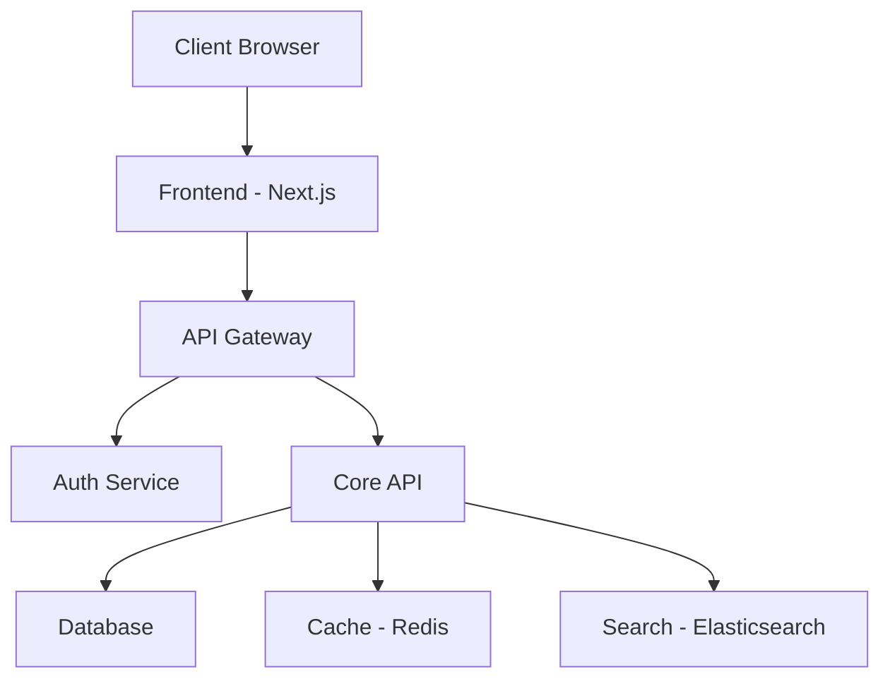
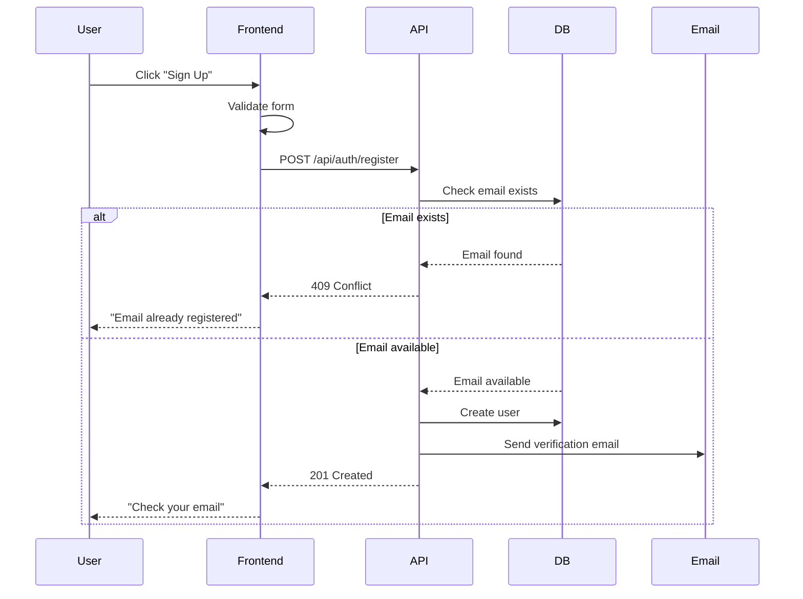

# [Project Name] - Product Requirements Document (PRD)

> **Version**: 1.0.0  
> **Last Updated**: YYYY-MM-DD  
> **Status**: Draft | In Review | Approved  
> **Owner**: [Your Name/Team]

---

## 📋 Document Information

| Field | Value |
|-------|-------|
| **Project Name** | [Your project name] |
| **Product Owner** | [Name] |
| **Tech Lead** | [Name] |
| **Target Release** | [Date or Version] |
| **Last Review Date** | [Date] |

---

## 1. Executive Summary

### 1.1 Problem Statement

**What problem are we solving?**

[Describe the core problem in 2-3 sentences]

**Example**:
> Current research management systems are fragmented across multiple platforms (Notion, Evernote, local files), making it difficult for researchers to maintain a cohesive knowledge graph of their academic work. This leads to lost connections between papers, duplicated research, and decreased productivity.

### 1.2 Goals & Objectives

**Primary Goals**:
1. [Goal 1 - be specific and measurable]
2. [Goal 2]
3. [Goal 3]

**Success Metrics**:
- [Metric 1: e.g., "80% user retention after 30 days"]
- [Metric 2: e.g., "Average session time > 15 minutes"]
- [Metric 3: e.g., "< 2s page load time"]

### 1.3 Target Users

| User Persona | Description | Key Needs |
|--------------|-------------|-----------|
| **Primary User** | [e.g., PhD students] | [e.g., Organize research papers, track citations] |
| **Secondary User** | [e.g., Professors] | [e.g., Collaborate with students, share resources] |

---

## 2. Features & Requirements

### 2.1 Core Features (MVP - Must Have)

#### Feature 1: [Feature Name]

**User Story**: As a [user type], I want to [action] so that [benefit].

**Requirements**:
1. [Specific requirement 1]
2. [Specific requirement 2]
3. [Specific requirement 3]

**Acceptance Criteria**:
- [ ] [Criteria 1 - testable condition]
- [ ] [Criteria 2]
- [ ] [Criteria 3]

**Edge Cases**:
- **Case 1**: [Scenario] → [Expected behavior]
- **Case 2**: [Scenario] → [Expected behavior]

**Priority**: 🔴 Must Have | 🟡 Should Have | 🟢 Could Have

---

#### Feature 2: [Feature Name]

[Repeat structure above]

---

### 2.2 Secondary Features (Should Have)

[List features important but not critical for launch]

---

### 2.3 Future Features (Could Have / Won't Have)

[Features deferred to later phases]

---

## 3. Technical Requirements

### 3.1 Technology Stack

| Component | Technology | Rationale |
|-----------|------------|-----------|
| **Frontend** | [e.g., React, Next.js] | [Why chosen] |
| **Backend** | [e.g., Node.js, FastAPI] | [Why chosen] |
| **Database** | [e.g., PostgreSQL, MongoDB] | [Why chosen] |
| **Authentication** | [e.g., Auth0, JWT] | [Why chosen] |
| **Hosting** | [e.g., Vercel, AWS] | [Why chosen] |

### 3.2 Architecture Overview



### 3.3 Data Models

#### User Model

```typescript
interface User {
  id: string;              // UUID
  email: string;           // Unique, indexed
  name: string;
  role: 'admin' | 'user';
  created_at: Date;
  updated_at: Date;
}
```

#### [Other Model Name]

```typescript
// Define your data models here
```

### 3.4 API Specifications

#### Endpoint: POST /api/auth/login

**Request**:
```json
{
  "email": "user@example.com",
  "password": "hashed_password"
}
```

**Response (Success - 200)**:
```json
{
  "token": "jwt_token_here",
  "user": {
    "id": "uuid",
    "email": "user@example.com",
    "name": "John Doe"
  },
  "expires_at": "2026-04-03T00:00:00Z"
}
```

**Response (Error - 401)**:
```json
{
  "error": "Invalid credentials",
  "code": "AUTH_INVALID_CREDENTIALS"
}
```

---

#### Endpoint: [Other Endpoint]

[Repeat structure]

---

### 3.5 Performance Requirements

| Metric | Target | Measurement |
|--------|--------|-------------|
| **Page Load Time** | < 2s (p95) | Lighthouse, WebPageTest |
| **API Response Time** | < 500ms (p95) | Server logs, APM |
| **Database Query Time** | < 100ms (p95) | Query analyzer |
| **Uptime** | 99.9% | Monitoring service |

### 3.6 Security Requirements

- [ ] **Authentication**: JWT with 24-hour expiration
- [ ] **Authorization**: Role-based access control (RBAC)
- [ ] **Data Encryption**: TLS 1.3 in transit, AES-256 at rest
- [ ] **Input Validation**: Sanitize all user inputs
- [ ] **Rate Limiting**: 100 requests/minute per user
- [ ] **OWASP Top 10**: Address all vulnerabilities

---

## 4. User Flows

### 4.1 User Registration Flow



### 4.2 [Other Flow Name]

[Add more user flows with Mermaid diagrams]

---

## 5. UI/UX Requirements

### 5.1 Wireframes

[Embed wireframe images or link to Figma]

**Example**:
```
+---------------------------+
|  Logo    Search    Login  |
+---------------------------+
|                           |
|   Main Content Area       |
|                           |
+---------------------------+
|  Footer                   |
+---------------------------+
```

### 5.2 Design System

| Element | Specification |
|---------|---------------|
| **Primary Color** | #3B82F6 (Blue) |
| **Secondary Color** | #10B981 (Green) |
| **Font** | Inter, sans-serif |
| **Border Radius** | 8px |
| **Spacing Unit** | 8px (base) |

### 5.3 Accessibility

- [ ] WCAG 2.1 Level AA compliance
- [ ] Keyboard navigation support
- [ ] Screen reader compatible
- [ ] Color contrast ratio > 4.5:1

---

## 6. Implementation Phases

### Phase 1: MVP (Week 1-4)

**Scope**:
- [ ] User authentication (email/password)
- [ ] Basic CRUD operations
- [ ] Dashboard with core metrics
- [ ] Responsive design (mobile + desktop)

**Deliverables**:
- [ ] Working prototype
- [ ] Basic documentation
- [ ] Unit tests (>80% coverage)

**Success Criteria**:
- [ ] 10 beta users onboarded
- [ ] No critical bugs
- [ ] Performance targets met

---

### Phase 2: Enhancement (Week 5-8)

**Scope**:
- [ ] OAuth integration (Google, GitHub)
- [ ] Advanced search & filters
- [ ] Email notifications
- [ ] Analytics dashboard

---

### Phase 3: Scale (Week 9-12)

**Scope**:
- [ ] API rate limiting
- [ ] Caching layer (Redis)
- [ ] CDN integration
- [ ] Load testing & optimization

---

## 7. Dependencies & Constraints

### 7.1 External Dependencies

| Dependency | Type | Risk Level | Mitigation |
|------------|------|------------|------------|
| [Service Name] | API | Medium | Have backup provider |
| [Library Name] | NPM Package | Low | Pin version |

### 7.2 Technical Constraints

- [ ] **Budget**: [Amount]
- [ ] **Timeline**: [Date range]
- [ ] **Team Size**: [Number]
- [ ] **Infrastructure**: [Limitations]

### 7.3 Assumptions

1. [Assumption 1 - e.g., "Users have modern browsers (Chrome 90+)"]
2. [Assumption 2]
3. [Assumption 3]

---

## 8. Testing Requirements

### 8.1 Test Coverage

| Test Type | Coverage Target | Tools |
|-----------|----------------|-------|
| **Unit Tests** | >80% | Jest, Vitest |
| **Integration Tests** | >60% | Supertest, Playwright |
| **E2E Tests** | Critical paths | Playwright, Cypress |

### 8.2 Test Scenarios

**Scenario 1: User Login**
- [ ] Successful login with valid credentials
- [ ] Failed login with invalid email
- [ ] Failed login with wrong password
- [ ] Account lockout after 5 failed attempts
- [ ] Password reset flow

---

## 9. Deployment & Operations

### 9.1 Deployment Strategy

- **Environment**: Development → Staging → Production
- **CI/CD**: GitHub Actions, automated tests on PR
- **Rollback**: Blue-green deployment, can rollback in < 5 minutes

### 9.2 Monitoring & Alerting

| Metric | Alert Threshold | Action |
|--------|----------------|--------|
| **Error Rate** | > 1% | Page on-call |
| **Response Time** | > 2s (p95) | Investigate |
| **CPU Usage** | > 80% | Auto-scale |

---

## 10. Risks & Mitigation

| Risk | Probability | Impact | Mitigation |
|------|-------------|--------|------------|
| [Risk 1] | High | High | [Plan] |
| [Risk 2] | Medium | Low | [Plan] |

---

## 11. Open Questions

- [ ] **Q1**: [Question that needs resolution]
  - **Owner**: [Name]
  - **Deadline**: [Date]
  - **Status**: Open | In Progress | Resolved

- [ ] **Q2**: [Another question]

---

## 12. Change Log

| Version | Date | Author | Changes |
|---------|------|--------|---------|
| 1.0.0 | YYYY-MM-DD | [Name] | Initial draft |
| 1.1.0 | YYYY-MM-DD | [Name] | Added API specs |

---

## 13. References

- [Link to Design Files (Figma, etc.)]
- [Link to Market Research]
- [Link to Competitor Analysis]
- [Link to Technical Spike Results]

---

## 14. Approval

| Role | Name | Signature | Date |
|------|------|-----------|------|
| **Product Owner** | [Name] | | |
| **Tech Lead** | [Name] | | |
| **Stakeholder** | [Name] | | |

---

**End of PRD Template**

---

## How to Use This Template

1. **Copy this file** to your project's `docs/PRD.md`
2. **Replace all placeholders** (text in [brackets])
3. **Delete unused sections** (if not applicable)
4. **Add project-specific sections** as needed
5. **Link from AGENTS.md** (see PRD_GUIDE.md)
6. **Keep updated** as requirements evolve

**Need help?** See [PRD_GUIDE.md](../PRD_GUIDE.md) for detailed writing guidelines.
