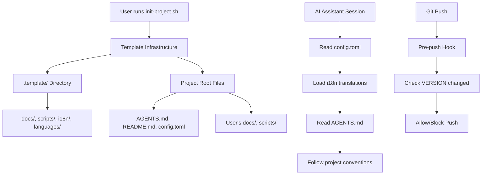
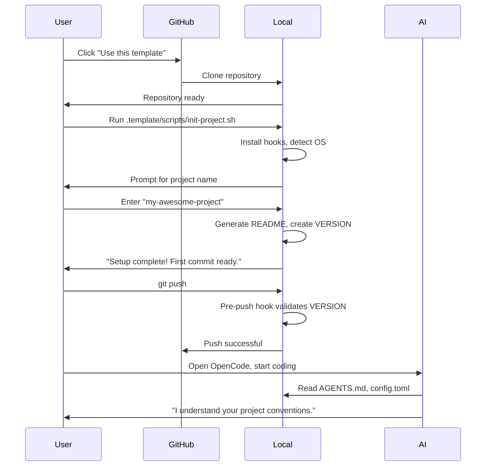
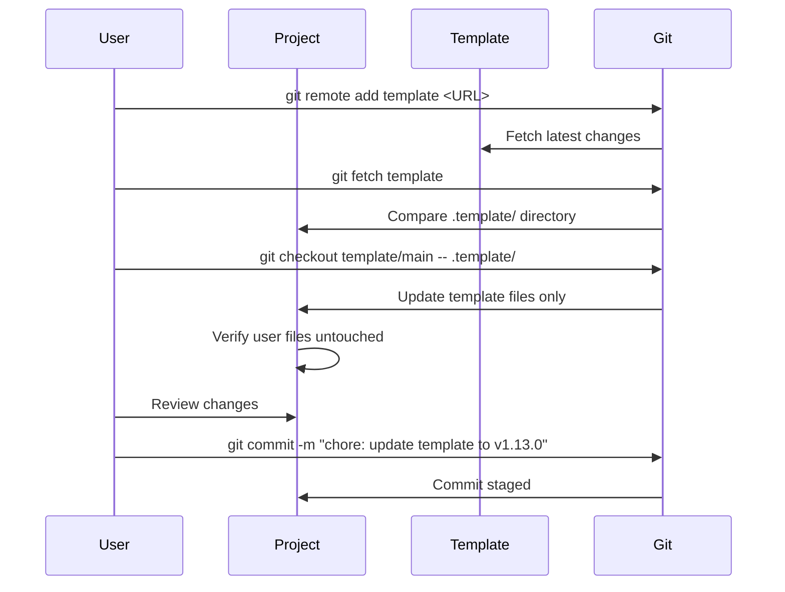

# My Vibe Scaffolding - Product Requirements Document (PRD)

> **Version**: 1.0.0  
> **Last Updated**: 2026-03-03  
> **Status**: Approved  
> **Owner**: Template Development Team

---

## 📋 Document Information

| Field | Value |
|-------|-------|
| **Project Name** | My Vibe Scaffolding |
| **Product Type** | Project Template / AI Development Framework |
| **Target Release** | Continuous (Semantic Versioning) |
| **Current Version** | v1.12.1 |
| **Repository** | https://github.com/matheme-justyn/my-vibe-scaffolding |

---

## 1. Executive Summary

### 1.1 Problem Statement

**What problem are we solving?**

Developers starting new projects face repetitive setup tasks: configuring git hooks, establishing documentation patterns, setting up AI assistant conventions, managing multi-language support, and handling version control. This leads to:

- **Inconsistent project structures** across teams
- **Lost productivity** recreating boilerplate code
- **Poor AI assistant integration** (no standardized AGENTS.md)
- **Lack of best practices** for documentation and architecture decisions

### 1.2 Goals & Objectives

**Primary Goals**:
1. **Reduce project setup time** from hours to minutes
2. **Standardize AI-assisted development** with AGENTS.md conventions
3. **Provide battle-tested infrastructure** (version control, i18n, ADR system)
4. **Enable seamless template updates** without overwriting user files

**Success Metrics**:
- **Time to first commit**: < 5 minutes after running init script
- **AI integration success rate**: 100% (AGENTS.md drives all major AI tools)
- **Template adoption**: Projects using this template report 50%+ faster onboarding
- **Zero conflicts**: Template updates never overwrite user project files

### 1.3 Target Users

| User Persona | Description | Key Needs |
|--------------|-------------|-----------|
| **Solo Developers** | Individual developers starting new projects | Fast setup, modern tooling, AI assistant support |
| **Small Teams (2-5)** | Startup teams needing consistent conventions | Shared coding standards, easy onboarding, documentation |
| **OSS Contributors** | Open-source project maintainers | Best practices, community-friendly structure, i18n support |
| **AI Power Users** | Developers using OpenCode/Cursor heavily | Optimized AGENTS.md, superpowers skills, multi-agent support |

---

## 2. Features & Requirements

### 2.1 Core Features (MVP - Must Have)

#### Feature 1: AI Agent Integration (AGENTS.md)

**User Story**: As a developer using AI assistants, I want a standardized AGENTS.md that defines coding conventions, commit format, and project context, so the AI understands my project without repeated explanations.

**Requirements**:
1. Pre-configured AGENTS.md with sections: Coding Conventions, Commit Message Format, Tech Stack, File Structure, What NOT to do
2. Compatible with OpenCode, Cursor, Windsurf
3. Multi-language support via i18n system (BCP 47)
4. Includes superpowers skills integration guide

**Acceptance Criteria**:
- [x] AGENTS.md exists in project root
- [x] AI tools (OpenCode/Cursor) read and follow conventions
- [x] Multi-language content loaded from `.template/i18n/locales/`
- [x] User can customize without breaking template updates

**Priority**: 🔴 Must Have

---

#### Feature 2: Version Management & Git Hooks

**User Story**: As a template maintainer, I need strict version control to prevent version chaos, ensuring every push updates the VERSION file.

**Requirements**:
1. Pre-push hook validates VERSION file has changed
2. `bump-version.sh` script automates version bumps (patch/minor/major)
3. Semantic versioning enforcement (MAJOR.MINOR.PATCH)
4. Automatic CHANGELOG.md update on version bump
5. Git tag creation synchronized with VERSION file

**Acceptance Criteria**:
- [x] Pre-push hook blocks pushes without version bump
- [x] Emergency bypass available (`--no-verify`)
- [x] Script validates current version vs latest git tag
- [x] Both `.template/VERSION` and root `VERSION` synced (scaffolding mode)

**Edge Cases**:
- **Case 1**: User forgets to bump version → Hook blocks push with helpful message
- **Case 2**: Version collision → Script detects and prevents duplicate tags
- **Case 3**: Manual version edit → Hook validates format (MAJOR.MINOR.PATCH)

**Priority**: 🔴 Must Have

---

#### Feature 3: File Isolation (.template/ Directory)

**User Story**: As a project user, I want template infrastructure separated from my project files, so template updates never overwrite my work.

**Requirements**:
1. All template infrastructure in `.template/` directory
2. Project files in root-level directories (`docs/`, `scripts/`, `assets/`)
3. Clear separation between template examples and user content
4. Migration script for legacy projects

**Acceptance Criteria**:
- [x] `.template/` contains: docs/, scripts/, i18n/, languages/
- [x] Root `docs/adr/` contains user ADRs (0001, 0005, 0006)
- [x] Template examples in `.template/docs/adr/` (0002-0004)
- [x] `init-project.sh` sets up correct structure

**Priority**: 🔴 Must Have

---

#### Feature 4: Multi-language Support (i18n System)

**User Story**: As a non-English developer, I want documentation and templates in my native language, so I can work efficiently without translation overhead.

**Requirements**:
1. BCP 47 language tags (zh-TW, en-US, ja-JP, etc.)
2. Translation files in `.template/i18n/locales/{lang}/`
3. AI agents read `config.toml` to determine user's language preference
4. Fallback to English if translation missing
5. Bilingual or separate README strategies

**Acceptance Criteria**:
- [x] `config.toml` defines `primary_locale` and `fallback_locale`
- [x] AI agents communicate in user's configured language
- [x] Translation files for: agents.toml, readme.toml, templates.toml, adr.toml
- [x] README generation respects `strategy` config (bilingual/separate/primary_only)

**Priority**: 🔴 Must Have

---

#### Feature 5: OpenCode Stability (Single-Instance Workflow)

**User Story**: As an OpenCode user, I need stable sessions without crashes, so I don't lose work in the middle of development.

**Requirements**:
1. Project-isolated database configuration (`.opencode-data/`)
2. Each project uses independent SQLite database
3. Automatic setup script (`init-opencode.sh`)
4. Smart cleanup to prevent database bloat
5. Documentation for multi-project usage

**Acceptance Criteria**:
- [x] `.vscode/settings.json` configures `opencode.dataDir`
- [x] Multiple projects can run simultaneously without conflicts
- [x] Session history persists across VSCode restarts
- [x] Database size < 10MB per project (vs 50MB+ shared)
- [x] Setup guide in `.template/docs/OPENCODE_SETUP_GUIDE.md`

**Priority**: 🔴 Must Have

---

### 2.2 Secondary Features (Should Have)

#### Feature 6: PRD (Product Requirements Document) System

**User Story**: As a team using AI for development, I want a structured PRD format that gives AI complete context, so it generates code that matches our requirements.

**Requirements**:
1. PRD template at `.template/docs/templates/PRD_TEMPLATE.md`
2. PRD writing guide at `.template/docs/PRD_GUIDE.md`
3. Integration with AGENTS.md (reference pattern)
4. Mermaid diagram examples for user flows
5. API specification format

**Priority**: 🟡 Should Have

---

#### Feature 7: Documentation Guidelines

**User Story**: As a project maintainer, I want clear rules about where to place documentation, so the project structure stays organized.

**Requirements**:
1. Comprehensive guide at `.template/docs/DOCUMENTATION_GUIDELINES.md`
2. File placement rules (template vs project files)
3. ADR naming conventions
4. README writing guide
5. Language usage policy (multi-language vs English-only)

**Priority**: 🟡 Should Have

---

### 2.3 Future Features (Could Have / Won't Have)

**Could Have**:
- Automated PRD generation from GitHub issues
- Visual project dashboard
- Template marketplace (different starter templates)
- Integration with Linear, Jira for project management

**Won't Have (Out of Scope)**:
- Runtime framework code (this is infrastructure only)
- Language-specific linters (covered by `languages/` modules)
- CI/CD pipeline definitions (user-specific)

---

## 3. Technical Requirements

### 3.1 Technology Stack

| Component | Technology | Rationale |
|-----------|------------|-----------|
| **Configuration** | TOML (`config.toml`) | Human-readable, supports comments, widely adopted |
| **Scripting** | Bash (POSIX-compliant) | Universal on Unix systems, minimal dependencies |
| **Version Control** | Git | Industry standard, required for version tracking |
| **Documentation** | Markdown | GitHub-native, AI-readable, version-controllable |
| **i18n System** | BCP 47 (RFC 5646) | W3C/IETF standard, precise language distinction |
| **Diagrams** | Mermaid | GitHub-native, text-based, version-controllable |

### 3.2 Architecture Overview



### 3.3 Data Models

#### config.toml Structure

```toml
[i18n]
primary_locale = "zh-TW"  # BCP 47 language tag
fallback_locale = "en-US"
commit_locales = ["en-US", "zh-TW"]

[i18n.readme]
strategy = "separate"  # or "bilingual" or "primary_only"

[project]
mode = "scaffolding"  # or "project"
sync_readme = true    # scaffolding mode only

[system]
os_type = "macOS"     # Auto-detected
shell = "/bin/zsh"

[opencode]
enabled = true

[opencode.project_database]
enabled = true
dirname = ".opencode-data"
```

#### VERSION File Format

```
1.12.1
```
- Single line
- Semantic versioning: MAJOR.MINOR.PATCH
- No 'v' prefix in file (added by git tag)

### 3.4 Key Scripts Specifications

#### Script: `init-project.sh`

**Purpose**: Initialize a new project from template

**Location**: `.template/scripts/init-project.sh`

**Workflow**:
```bash
#!/usr/bin/env bash
# 1. Check git repository exists
# 2. Detect OS and update config.toml
# 3. Install git hooks
# 4. Initialize VERSION file (1.0.0)
# 5. Prompt for project metadata
# 6. Generate README from i18n templates
# 7. Create .template-version marker
```

**Exit Codes**:
- `0`: Success
- `1`: Not a git repository
- `2`: config.toml not found

---

#### Script: `bump-version.sh`

**Purpose**: Increment version number and sync files

**Location**: `.template/scripts/bump-version.sh`

**Usage**:
```bash
bump-version.sh patch   # 1.2.3 -> 1.2.4
bump-version.sh minor   # 1.2.3 -> 1.3.0
bump-version.sh major   # 1.2.3 -> 2.0.0
```

**Actions**:
1. Validate current version format
2. Compare with latest git tag
3. Increment version number
4. Update `.template/VERSION` and `VERSION` (if scaffolding mode)
5. Commit with message: "chore: bump version to X.Y.Z"
6. Create git tag `vX.Y.Z`

---

### 3.5 Performance Requirements

| Metric | Target | Measurement |
|--------|--------|-------------|
| **init-project.sh execution** | < 30s | Time to complete (macOS, Linux) |
| **Template size (cloned)** | < 5MB | Git repo size |
| **AI agent session start** | < 5s | Time to read AGENTS.md + i18n files |
| **Pre-push hook execution** | < 2s | Version validation time |

### 3.6 Security Requirements

- [x] **No secrets in repository**: All credentials externalized
- [x] **Git hook bypass documented**: Emergency `--no-verify` usage
- [x] **Script input validation**: Prevent injection attacks in bump-version.sh
- [x] **File permissions**: Scripts executable (755), configs readable (644)
- [x] **.gitignore coverage**: Sensitive files excluded (config.toml, .opencode-data/)

---

## 4. User Flows

### 4.1 New Project Setup Flow



### 4.2 Template Update Flow



---

## 5. Implementation Phases

### Phase 1: MVP (✅ Completed - v1.0.0 to v1.8.0)

**Scope**:
- [x] Basic AGENTS.md template
- [x] Git hooks system (pre-push version check)
- [x] Version management scripts
- [x] ADR system (0001-0004 examples)
- [x] i18n system (BCP 47)

---

### Phase 2: Stability & Isolation (✅ Completed - v1.9.0 to v1.12.0)

**Scope**:
- [x] OpenCode single-instance workflow (ADR 0005)
- [x] `.template/` directory isolation (ADR 0006)
- [x] OpenCode project-isolated database
- [x] Automated init-opencode.sh script
- [x] PRD system (guide + template)

---

### Phase 3: Enhancement (🚧 Current - v1.13.0+)

**Scope**:
- [ ] Migration script (migrate-to-template-dir.sh)
- [ ] Additional language support (ja-JP, zh-CN)
- [ ] Video tutorials for setup
- [ ] Template showcase (real-world examples)

---

### Phase 4: Ecosystem (📅 Planned - v2.0.0)

**Scope**:
- [ ] Template variants (frontend, backend, fullstack)
- [ ] Plugin system for language modules
- [ ] Web-based project initializer
- [ ] Integration with popular AI tools (Claude Projects, GitHub Copilot)

---

## 6. Dependencies & Constraints

### 6.1 External Dependencies

| Dependency | Type | Risk Level | Mitigation |
|------------|------|------------|------------|
| Git | Version Control | Low | Industry standard, stable |
| Bash | Shell Scripting | Low | POSIX-compliant, universal |
| OpenCode | AI Assistant | Medium | Document alternatives (Cursor, Windsurf) |
| GitHub | Repository Hosting | Low | Git is tool-agnostic |

### 6.2 Technical Constraints

- [x] **Platform**: macOS, Linux (Windows via WSL or Git Bash)
- [x] **Git Version**: 2.20+ (for modern hook support)
- [x] **Bash Version**: 3.2+ (macOS default)
- [x] **No Runtime Dependencies**: Pure bash + git

### 6.3 Assumptions

1. **Users have basic Git knowledge** (clone, commit, push)
2. **Projects will use semantic versioning** (MAJOR.MINOR.PATCH)
3. **AI assistants support file reading** (AGENTS.md, config.toml)
4. **Users understand English** (fallback language for technical docs)

---

## 7. Testing Requirements

### 7.1 Test Coverage

| Test Type | Coverage Target | Tools |
|-----------|----------------|-------|
| **Script Tests** | 100% | Bash test framework (bats) |
| **Hook Tests** | 100% | Git test repositories |
| **Integration Tests** | Critical paths | Manual testing checklist |

### 7.2 Test Scenarios

**Scenario 1: Version Bump Script**
- [x] Successful patch bump (1.0.0 → 1.0.1)
- [x] Successful minor bump (1.0.1 → 1.1.0)
- [x] Successful major bump (1.1.0 → 2.0.0)
- [x] Reject invalid version format
- [x] Detect version already exists (git tag)
- [x] Sync both VERSION files in scaffolding mode

**Scenario 2: Pre-push Hook**
- [x] Block push when VERSION unchanged
- [x] Allow push when VERSION updated
- [x] Allow push with --no-verify
- [x] Detect scaffolding vs project mode

**Scenario 3: init-project.sh**
- [x] Successful first-time setup
- [x] Reject if not a git repository
- [x] Detect OS correctly (macOS, Linux)
- [x] Generate README based on i18n config
- [x] Install git hooks

---

## 8. Deployment & Operations

### 8.1 Deployment Strategy

- **Release**: Via GitHub releases + git tags
- **Versioning**: Semantic Versioning (enforced by pre-push hook)
- **Changelog**: Manually maintained in `.template/CHANGELOG.md`
- **Distribution**: GitHub template repository

### 8.2 Monitoring & Feedback

| Metric | Source | Action |
|--------|--------|--------|
| **Template Usage** | GitHub "Used by" count | Track adoption |
| **Issue Reports** | GitHub Issues | Fix within 1 week (critical), 1 month (minor) |
| **User Feedback** | GitHub Discussions | Review monthly, prioritize features |

---

## 9. Risks & Mitigation

| Risk | Probability | Impact | Mitigation |
|------|-------------|--------|------------|
| **AI tool incompatibility** | Medium | High | Document AGENTS.md as standard, test with multiple tools |
| **Git hook bypass** | High | Low | Educate users, document when `--no-verify` is appropriate |
| **Template update conflicts** | Low | Medium | `.template/` isolation prevents this |
| **i18n translation outdated** | Medium | Low | Community contributions, fallback to English |

---

## 10. Open Questions

- [x] **Q1**: Should we support Windows natively (non-WSL)?
  - **Status**: Resolved - Support via Git Bash or WSL, no native PowerShell
  - **Deadline**: N/A

- [ ] **Q2**: Should we split into multiple template variants?
  - **Owner**: Template Team
  - **Deadline**: v2.0.0 consideration
  - **Status**: Open

---

## 11. Change Log

| Version | Date | Author | Changes |
|---------|------|--------|---------|
| 1.0.0 | 2026-03-03 | Template Team | Initial PRD created |

---

## 12. References

- [GitHub Repository](https://github.com/matheme-justyn/my-vibe-scaffolding)
- [AGENTS.md Standard](https://github.com/ohmyopencode/AGENTS.md)
- [Semantic Versioning](https://semver.org/)
- [BCP 47 Language Tags](https://www.rfc-editor.org/rfc/rfc5646.html)
- [Vygotsky's Scaffolding Theory](https://en.wikipedia.org/wiki/Instructional_scaffolding)

---

## 13. Approval

| Role | Name | Date |
|------|------|------|
| **Template Owner** | Justyn Chen | 2026-03-03 |
| **Primary Contributor** | AI Assistant | 2026-03-03 |

---

**End of PRD**
