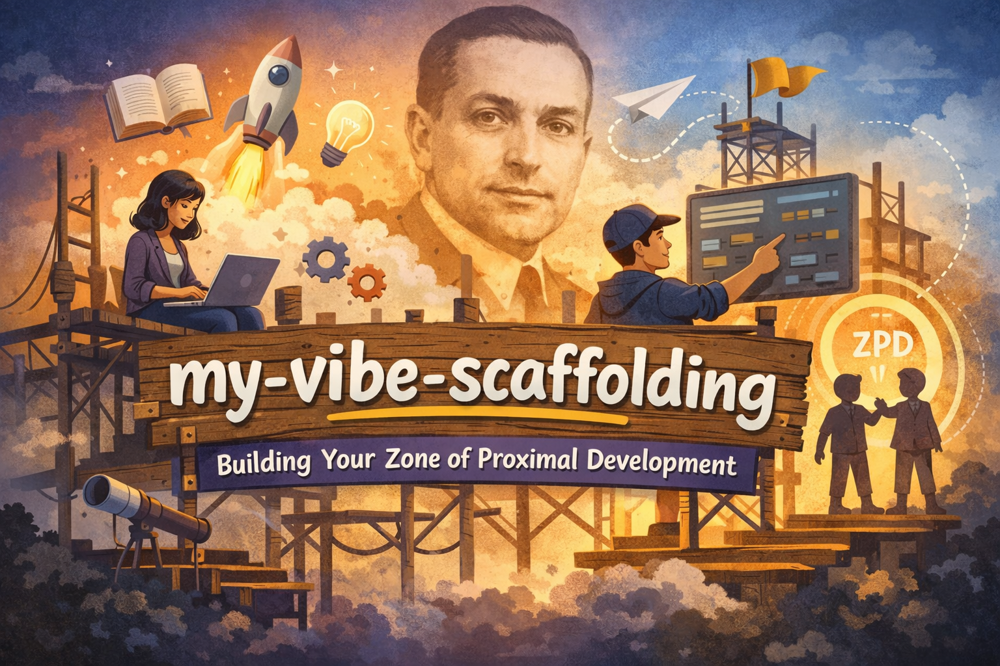

# My Vibe Coding Template

---

## 🏛️ 理念與靈感 | Concept & Inspiration

### Vygotsky 的鷹架理論 | Vygotsky's Scaffolding Theory

心理學家 Lev Vygotsky 提出的 **鷹架理論**：透過暫時性的支持結構，幫助學習者從當前能力提升到潛在發展區（ZPD）。一旦學習者成長，鷹架就逐步拆除。

**Scaffolding theory** by psychologist Lev Vygotsky: temporary support structures help learners progress from current capability to their Zone of Proximal Development (ZPD). Once learners grow, the scaffolding is gradually removed.

### Vibe Coding = 程式開發的鷹架

**Vibe Coding 就是這種概念的實踐：**

- 🪧 **AI 作為鷹架** — 快速建立專案骨架、遵循最佳實踐
- 🛠️ **模板作為結構** — 精心設計的檔案結構、編碼規範、工作流程
- 📈 **逐步成長** — 客製化模板、調整規範、形成自己的風格
- 🔄 **可拆除性** — 不再需要時可自由拆除或修改

**Vibe Coding embodies this concept:**

- 🪧 **AI as Scaffolding** — Build foundations quickly, follow best practices
- 🛠️ **Template as Structure** — Pre-designed files, conventions, workflows
- 📈 **Progressive Growth** — Customize, adjust, develop your own style
- 🔄 **Removability** — Remove or modify when no longer needed

這是一個 **成長式的學習與開發框架**，在 AI 輔助下逐步提升開發技能。

A **growth-oriented learning and development framework** that progressively improves your development skills with AI assistance.

---

## 🚀 使用方式

1. 點擊 GitHub 上的 **"Use this template"** 按鈕
2. 建立新的 repository
3. Clone 到本地開始開發

## 📁 包含檔案

此模板包含以下檔案和目錄結構：

### 核心設定檔

- **`AGENTS.md`** - OpenCode AI agent 的主要指令文件，定義專案規範、編碼慣例和工作流程
- **`opencode.json`** - OpenCode 的專案層級設定檔，可在此加入專案特定的 MCP servers
- **`.gitignore`** - 通用的 Git 忽略規則，包含常見的 OS、編輯器和語言 artifacts
- **`.editorconfig`** - 統一的編輯器設定（縮排、編碼、換行符等）
- **`.env.example`** - 環境變數範例檔案，提供設定結構但不含真實值
- **`VERSION`** - 當前模板版本號（語意化版本）
- **`CHANGELOG.md`** - 版本變更歷史記錄
- **`TEMPLATE_SYNC.md`** - 模板更新同步指南

### GitHub Templates

- **`.github/ISSUE_TEMPLATE/bug_report.md`** - Bug 回報的 issue 模板
- **`.github/ISSUE_TEMPLATE/feature_request.md`** - 功能請求的 issue 模板
- **`.github/pull_request_template.md`** - Pull Request 模板
- **`.github/workflows/ci-placeholder.yml`** - GitHub Actions CI workflow 佔位檔案

### 文件

- **`docs/adr/0001-record-architecture-decisions.md`** - 架構決策記錄（ADR）的首個範例，說明為何使用 ADR

## 📝 編碼規範

- 永遠先寫測試（TDD）
- 所有函數要有 docstring 和型別標注
- 避免過度工程化
- Commit message 使用繁體中文

詳細規範請參考 `AGENTS.md`。

## 🔖 版本管理

此模板採用 [語意化版本 2.0.0](https://semver.org/lang/zh-TW/) 進行版本管理。

- **查看當前版本**：`cat VERSION`
- **查看版本歷史**：參閱 [CHANGELOG.md](./CHANGELOG.md)
- **同步模板更新**：參閱 [TEMPLATE_SYNC.md](./TEMPLATE_SYNC.md)

### 如何將模板更新同步到現有專案？

如果你已經使用舊版本建立了專案，當模板發布新版本時，你可以選擇性地將新功能引入到你的專案中。

詳細的同步方法請參考 [TEMPLATE_SYNC.md](./TEMPLATE_SYNC.md)，支援：

- ✅ 選擇性手動同步（推薦）
- ✅ 使用 Git Remote 追蹤
- ✅ 完整差異比對

## 🎯 適用場景

這個模板適合：
- 需要 AI 輔助開發的專案
- 重視程式碼品質和文件的專案
- 採用測試驅動開發（TDD）的專案
- 需要記錄架構決策的專案

## 📚 資源

- [OpenCode 官方文件](https://github.com/OpenCodeProject/opencode)
- [Architecture Decision Records (ADR)](https://adr.github.io/)
- [語意化版本規範](https://semver.org/lang/zh-TW/)
- [Keep a Changelog](https://keepachangelog.com/zh-TW/1.0.0/)

## 📄 授權

此模板使用 MIT 授權。你可以自由使用、修改和分發。
